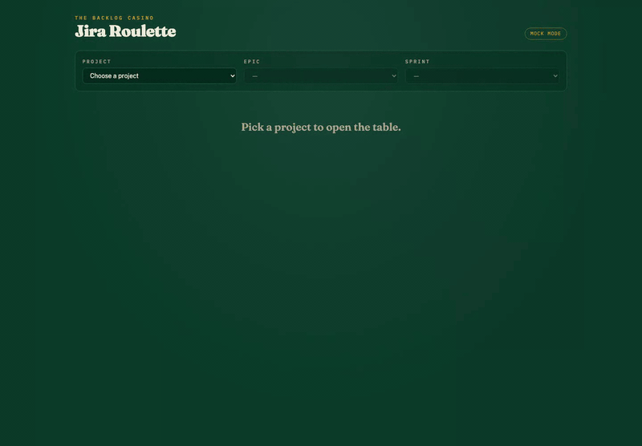
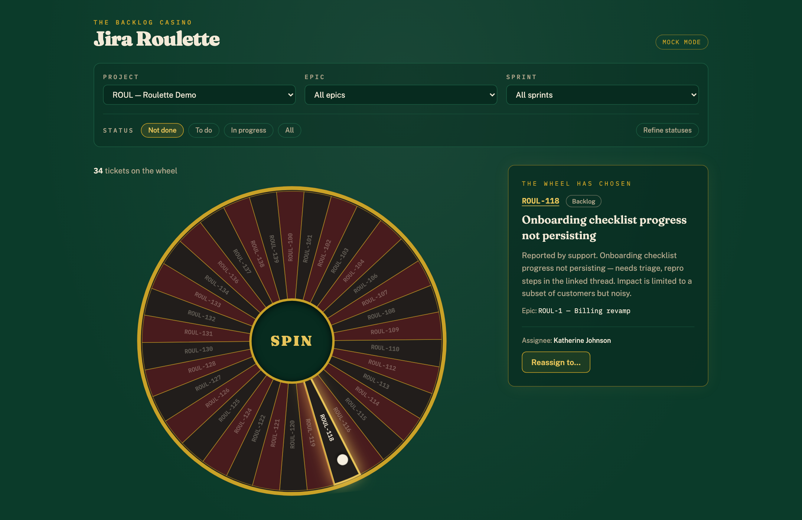
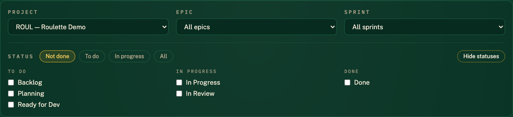

# Jira Roulette

Spin a roulette wheel over your Jira backlog. Filter by project, epic, sprint,
and status; the wheel picks the next ticket and lets you assign it in one click.



When the ball drops, the winning pocket glows and its card appears with the
ticket's status, description, epic, and a one-click assign action:



## Setup

```bash
npm install
cp .env.example .env   # then fill in your Jira site, email, and API token
npm run dev
```

Create an API token at
<https://id.atlassian.com/manage-profile/security/api-tokens>.

The Vite dev server proxies `/jira/*` to your Jira Cloud site and injects the
Authorization header server-side — your token never reaches browser code.
Restart the dev server after changing `.env`.

## No Jira handy?

Open <http://localhost:5173/?mock=1> to play with ~40 fake tickets.

## How it works

- **Filters** build a JQL query (`POST /rest/api/3/search/jql`). The default
  status filter is "Not done" (`statusCategory IN ("To Do", "In Progress")`);
  "Refine statuses" lets you pick exact workflow statuses like *Ready for Dev*
  or *Planning*:

  
- **The wheel** alternates red/black pockets like a real rotor, and a ball
  races the opposite direction around the rim before dropping into the winning
  pocket — the wheel stops wherever it stops, so the ball can land at any
  position. An odd ticket count gets a single green "zero" pocket. The hub is
  the spin button.
- **Assigning** calls `PUT /rest/api/3/issue/{key}/assignee`, so the token's
  account needs assign permission in the project.
- Fetching caps at 400 tickets per spin table; a banner tells you to narrow
  the filters beyond that.

## Scripts

- `npm run dev` — start the app
- `npm run test` — unit tests for the JQL builder, ADF flattener, and wheel math
- `npm run typecheck` / `npm run build`
